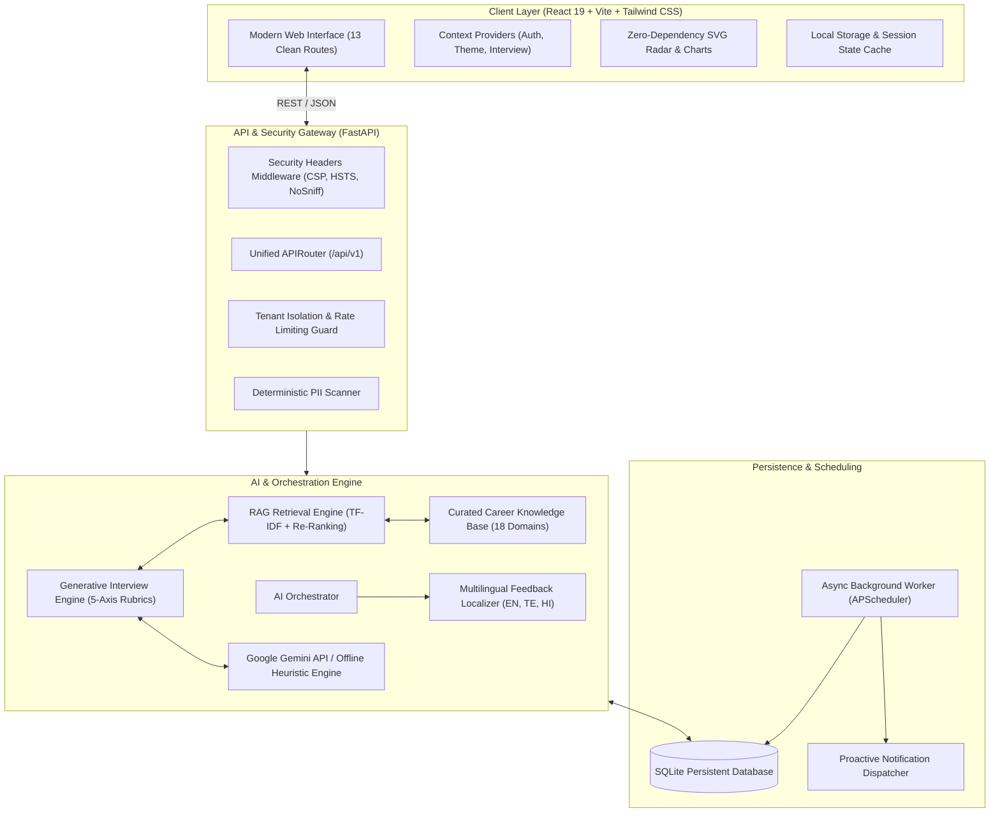

# AI Career Preparation Agent 🤖🎯

[](https://opensource.org/licenses/MIT)
[](https://www.python.org/)
[](https://fastapi.tiangolo.com/)
[](https://react.dev/)
[](https://tailwindcss.com/)
[-brightgreen.svg)]()
[]()

> **An autonomous, full-stack career preparation agent** that unifies ATS resume parsing, multi-turn adaptive generative mock interviews, competency radar profiling, Retrieval-Augmented Generation (RAG) curriculum grounding, and proactive retention scheduling into a single closed-loop career acceleration platform.

---

## 📌 Overview & Elevator Pitch

Job seekers frequently face fragmented preparation workflows: static LeetCode problem sets do not evaluate verbal technical communication; standard interview question lists lack personalized feedback; and ATS parsers provide superficial scores without prescriptive remedies.

The **AI Career Preparation Agent** resolves these challenges through an **autonomous, closed-loop engineering architecture**. Rather than functioning as a passive chatbot, the system continuously analyzes candidate evidence across resumes, hands-on coding drills, and multi-turn technical interviews. It isolates specific competency gaps, formulates an explainable **Next-Best-Action (NBA)**, adapts question difficulty in real time, and proactively drives skill mastery with zero vendor lock-in or ungrounded hallucinations.

---

## ✨ Key Platform Capabilities

### 1. Real-Time Bidirectional AI Voice Interviewing (Gemini Live API)
- **Sub-Second Latency WebSocket Streaming:** Direct browser-to-Gemini Live API full-duplex WebSocket connection (`gemini-2.0-flash-exp` / Live API) streaming linear 16-bit PCM audio (16kHz uplink, 24kHz downlink) with true conversational back-and-forth.
- **Natural Conversational Interruption (Barge-In):** Local speech energy detection and Web Audio API queue management instantly halts active audio playback (`player.interrupt()`) when the candidate begins speaking, replicating real-life interview dynamics without awkward turn delays.
- **Secure Ephemeral Token Architecture:** Backend provisioning (`POST /api/realtime-voice/session`) issues time-bounded, single-use access tokens via Google Cloud REST endpoint, ensuring permanent zero-leakage of production API keys to client browsers.
- **Interactive Chamber Visualization:** Glassmorphic interview chamber featuring an organic glowing orb visualizer responding dynamically to Gemini's vocal intensity, a real-time candidate decibel microphone meter, instantaneous barge-in indicators, and live closed-caption streaming.
- **Graceful Fallback Simulation:** Production-grade degradation layer automatically switches to intelligent simulated voice interaction with synthesized audio and scripted prompts when running in environments without live API credentials.

### 2. Multi-Turn Generative Interview Engine
- **Context-Grounded Question Synthesis:** Generates dynamic, non-repetitive interview questions tailored to the candidate's target role, extracted resume skills, active skill gaps, and verified curriculum nodes.
- **5-Axis Formative Evaluation:** Evaluates every candidate response across five core hiring axes (0–100):
  - *Technical Accuracy:* Correctness, conceptual depth, and domain precision.
  - *Problem Solving:* Trade-off analysis, structural breakdown, and edge-case awareness.
  - *Communication Quality:* Concise articulation, STAR framework alignment, and narrative structure.
  - *Completeness & Depth:* Production engineering nuances and system-level considerations.
  - *Confidence & Delivery:* Clear reasoning, quantitative grounding, and poise.
- **Dynamic Difficulty Adaptation:** Adaptively scales pacing turn-by-turn—escalating to senior architectural trade-offs on high scores ($\ge 85$), probing practical depth on intermediate scores ($50–84$), and providing foundational reinforcement when gaps are identified ($< 50$).
- **Anti-Repetition Engine:** Cross-session memory ensures consecutive mock interviews for the same role and candidate never repeat questions.

### 3. Remote Multi-Tier Secure Sandbox Code Execution
- **Multi-Tier Isolation Architecture:**
  - *Docker Sandbox (`DockerSandboxExecutor`):* Containerized execution with `--read-only` root filesystem, dropped capabilities (`ALL`), unprivileged user (`1000:1000`), network isolation (`none`), and memory limits (256MB).
  - *Firecracker Micro-VM (`FirecrackerSandboxExecutor`):* Hypervisor-level hardware virtualization utilizing Linux KVM for multi-tenant kernel boundary security.
  - *Local Process Jail (`ProcessSandboxExecutor`):* Ephemeral directory sandbox with strict secret scrubbing (stripping `GEMINI_API_KEY`, `DATABASE_URL`, `JWT_SECRET`), bounded standard streams, hard process kill timeouts (3s), and resource quotas.
- **Server-Side Hidden Test Case Evaluation:** Automatically compiles solutions against private unit tests and assert constraints without exposing test inputs or expected outputs to untrusted clients.
- **Zero Server-Side `exec()` / `eval()`:** Untrusted user code is strictly prohibited from executing within the FastAPI server process, guaranteeing immunity against remote code execution (RCE) vulnerabilities.
- **Live Terminal & Telemetry Drawer:** Embedded terminal in Skill Arena displaying standard output, standard error, execution time in milliseconds, memory consumption, exit codes, and test pass/fail breakdowns.

### 4. Deterministic ATS Resume Scanner
- **Multi-Format Document Extraction:** Hardened parser supporting PDF (PyMuPDF `fitz`), DOCX (`python-docx`), TXT, and Markdown files.
- **Security & Upload Hardening:** Validates file magic signatures (`%PDF`, `PK\x03\x04`), rejects binaries (`.exe`, `.zip`), enforces a 10MB upload limit, and alerts users if a non-extractable scanned image PDF is uploaded.
- **Canonical Skill Taxonomy:** Regex word-boundary taxonomy normalizing hundreds of technical aliases (`sklearn` $\rightarrow$ `Scikit-learn`, `k8s` $\rightarrow$ `Kubernetes`, `tf` $\rightarrow$ `TensorFlow`, `postgres` $\rightarrow$ `PostgreSQL`).
- **Transparent 5-Tier Rubric (0–100):** Evaluates Skill Match (40 pts), Target-Role Alignment (25 pts), Projects & Quantifiable Metrics (15 pts), Completeness (10 pts), and Keyword Density (10 pts).
- **Closed-Loop Career Sync:** Missing core skills automatically seed the `skill_gaps` table as High-Priority items, award +35 XP, update calendar streaks, and trigger real-time Next-Best-Action recalculation.

### 5. Competency Radar & Autonomous Skill Gap Analyzer
- **Zero-Dependency SVG Competency Radar:** Renders an interactive 6-axis visualization (Technical Knowledge, Problem Solving, Communication, Confidence, Relevance, System Design).
- **Multi-Source Evidence Aggregation:** Seamlessly aggregates evidence from ATS audits, Skill Arena challenges, and generative interview evaluations.
- **Autonomous Next-Best-Action (NBA):** Generates transparent, explainable recommendations directing candidates to high-yield actions (e.g., targeted algorithmic drills, behavioral framing exercises, or architectural deep-dives).

### 6. Retrieval-Augmented Generation (RAG) Architecture
- **Curated Knowledge Base:** 18 domain-specific curriculum modules covering Machine Learning, MLOps, System Design, Python Internals, Behavioral (STAR), SQL, and ATS Optimization.
- **Sub-Millisecond Vector Retrieval:** Local TF-IDF and cosine similarity search (`scikit-learn` vectorization) ensuring grounded technical context with zero external API costs or rate limits.
- **Dynamic Context Re-Ranking:** Automatically re-ranks retrieved chunks based on candidate target role (+15% boost) and active skill gaps (+25% boost).
- **Hallucination Guard:** Rigorous similarity thresholds reject out-of-scope queries with transparent, pedagogical fallbacks instead of fabricating answers.

### 7. Hands-on Skill Arena & Conceptual Drills
- **Four Technical Practice Modes:**
  1. *Coding Challenges:* Pattern-based algorithmic problems executed and graded inside the secure sandbox with hidden test cases.
  2. *Debug Challenges:* Production code snippets containing intentional bugs (e.g., mutable default arguments, PyTorch gradient leakage).
  3. *Technical MCQs:* Conceptual questions exploring critical engineering distinctions and edge cases.
  4. *Predict Output:* Safe execution tracing evaluating language runtime mechanics.

### 8. Multilingual AI Feedback Engine
- **Multilingual Support:** Fully configurable feedback delivery in **English**, **Telugu (తెలుగు)**, and **Hindi (हिन्दी)**.
- **Technical Term Preservation:** Critical engineering terminology (e.g., *Transformer*, *ROC-AUC*, *STAR Method*, *Latency*, *Docker*) remains intact in English for authenticity.
- **Score Invariance:** Evaluation scores and rubrics remain strictly objective and identical across all languages.

### 9. Peer Interview Experiences & Community Knowledge Base
- **Candidate-Contributed Archives:** Real-world interview logs, question topics, difficulty ratings, and preparation tips.
- **Automated PII Sanitization:** Deterministic pre-flight regex scanner detects and redacts personal names, phone numbers, emails, bearer tokens, and sensitive URLs before storage.
- **Moderation Workflow:** Multi-stage moderation pipeline (`PENDING`, `APPROVED`, `FLAGGED`, `REJECTED`) feeding approved questions back into the live RAG knowledge base.

### 10. Progress Analytics & Automated Retention Scheduling
- **Weekly AI Career Reports:** Automated 7-day synthesis comparing week-over-week velocity ($+N$ interviews, $+N$ solved drills, $+N$ XP earned).
- **Weekly Goals & 30-Day Streak Recovery:** Set weekly targets and protect habits with a single streak recovery allowance per 30-day rolling window.
- **Proactive Background Scheduler:** Asynchronous asyncio worker periodically evaluates student practice recency and dispatches responsive HTML reminder emails with anti-spam suppression if already active today.

---

## 🏗️ System Architecture & Closed-Loop Workflow



### The Autonomous Closed-Loop Cycle

1. **Perception:** The candidate uploads their resume (PDF/DOCX/TXT). The ATS engine extracts skills and flags missing requirements.
2. **Diagnosis:** Skill deficits automatically populate the candidate's active profile as high-priority gaps.
3. **Prescription:** The Autonomous Decision Engine synthesizes the state and outputs an explainable **Next-Best-Action**.
4. **Targeted Practice:** The candidate engages in generative mock interviews and Skill Arena drills focused precisely on those gaps.
5. **Demonstrated Mastery:** Passing scores create verified skill evidence records, closing gaps and elevating the candidate's holistic **Readiness Band**.
6. **Habit Retention:** The background scheduler monitors engagement velocity, prompting timely follow-up before streaks lapse.

---

## 💻 Technology Stack

| Layer | Technologies | Purpose |
|---|---|---|
| **Frontend Framework** | React 19, Vite 8 | Ultra-responsive SPA with rapid Hot Module Replacement |
| **Real-Time Voice Engine** | Google Gemini Live API, Web Audio API | Full-duplex bidirectional PCM audio streaming, sub-second latency, barge-in |
| **Code Sandbox Isolation** | Subprocess Jail, Docker, Firecracker | Isolated code execution, memory limits (256MB), timeout kill (3s), secret scrubbing |
| **Styling & Theming** | Tailwind CSS v4, Lucide Icons | Glassmorphic aesthetics across 6 configurable color palettes |
| **Data Visualizations** | Custom SVG Components | Zero-dependency, accessible radar charts, score rings, and timelines |
| **Backend API** | FastAPI, Uvicorn, Python 3.10+ | High-throughput asynchronous REST microservices |
| **Data & ORM** | SQLAlchemy, SQLite | Persistent storage, transactional integrity, and automated schema migrations |
| **Validation & Types** | Pydantic v2 | Strict request/response validation and schema enforcement |
| **AI & Retrieval** | Gemini API (`google-genai`), Scikit-learn | Multi-turn reasoning, RAG TF-IDF vectorization, and deterministic heuristics |
| **Document Processing** | PyMuPDF (`fitz`), `python-docx` | Robust multi-format document extraction and magic-byte inspection |
| **Scheduling** | Asyncio Background Tasks | Non-blocking periodic streak auditing and email notification delivery |
| **Testing & Quality** | Pytest, Unittest, ESLint | Comprehensive test suites across business logic, security, and UI builds |

---

## 📁 Repository Structure

```
AI-Career-Preparation-Agent/
├── backend/
│   ├── app/
│   │   ├── api/
│   │   │   ├── routes/              # Modular API route controllers
│   │   │   │   ├── activities.py    # XP and activity logging
│   │   │   │   ├── career_journey.py# 14-milestone lifecycle and readiness bands
│   │   │   │   ├── challenges.py    # Daily practice drills and evaluations
│   │   │   │   ├── execution.py     # Remote sandbox code execution API
│   │   │   │   ├── experiences.py   # Peer interview archives & moderation
│   │   │   │   ├── feedback.py      # User product feedback endpoints
│   │   │   │   ├── goals.py         # Weekly commitments & streak recovery
│   │   │   │   ├── interviews.py    # Generative AI interview session controller
│   │   │   │   ├── profile.py       # Candidate profile and target roles
│   │   │   │   ├── progress.py      # Gamification and level progression
│   │   │   │   ├── realtime_voice.py# Real-time Gemini Live voice session controller
│   │   │   │   ├── recommendations.py # Autonomous Next-Best-Action generator
│   │   │   │   ├── skill_arena.py   # Hands-on coding challenges & grading
│   │   │   │   ├── skills.py        # 6-axis skill taxonomy and radar data
│   │   │   │   └── weekly_reports.py# Automated weekly performance digests
│   │   │   ├── reminders.py         # Email reminder status and triggers
│   │   │   ├── resume.py            # ATS resume upload and analysis
│   │   │   └── router.py            # Central FastAPI API router
│   │   ├── core/
│   │   │   └── config.py            # Typed application settings via Pydantic BaseSettings
│   │   ├── db/
│   │   │   ├── database.py          # SQLAlchemy engine, session maker, migrations
│   │   │   └── models.py            # Database entities (User, Interview, SkillGap, etc.)
│   │   ├── schemas/                 # Pydantic request/response schemas
│   │   ├── services/
│   │   │   ├── ai/                  # RAG knowledge base, embeddings, prompt builder
│   │   │   │   └── voice/           # Gemini Live API token & transcript orchestrator
│   │   │   ├── interview_engine.py  # 5-axis generative interview orchestrator
│   │   │   ├── pii_detection_service.py # Pre-flight regex PII scrubber
│   │   │   ├── resume_analysis_service.py # ATS scoring & keyword analysis
│   │   │   ├── resume_extractor.py  # Safe multi-format document parser
│   │   │   ├── sandbox/             # Docker, Firecracker & Process sandbox executors
│   │   │   └── scheduler.py         # Asyncio background email reminder worker
│   │   └── main.py                  # FastAPI application entrypoint with security headers
│   ├── career_agent.db              # SQLite persistent database file
│   └── requirements.txt             # Python backend dependencies
├── src/
│   ├── components/                  # Reusable UI components (Sidebar, Navbar, Cards)
│   │   └── voice/                   # RealtimeVoiceChamber & glowing orb visualizer
│   ├── context/                     # Global state (AuthContext, ThemeContext, InterviewContext)
│   ├── pages/                       # Route views (Dashboard, ATS, MockInterview, SkillArena, etc.)
│   ├── services/                    # API client modules interfacing with FastAPI backend
│   │   ├── executionApi.js          # Sandbox code execution client
│   │   ├── realtimeVoiceApi.js      # Ephemeral session & transcript client
│   │   └── voice/                   # Web Audio API PCM capture, playback & WebSocket client
│   ├── utils/                       # Storage adapters, date formatters, and telemetry helpers
│   ├── App.jsx                      # Client router configuration and layout bindings
│   └── main.jsx                     # Vite/React DOM entrypoint
├── tests/
│   ├── test_generative_interview_engine.py # 16-scenario generative engine integration test
│   ├── test_phase16_multilingual.py        # Multilingual localization & term preservation tests
│   ├── test_phase17_experiences.py         # PII scanner, moderation, and RAG attribution tests
│   ├── test_phase18_career_journey.py      # 14-milestone lifecycle & readiness band tests
│   ├── test_phases_19_to_22.py             # Reports, goals, feedback, and security probes
│   ├── test_realtime_voice.py              # Gemini Live token provisioning & transcript tests
│   └── test_secure_sandbox.py              # Isolated execution, timeouts & secret scrubbing tests
├── .env.example                     # Root environment configuration template
├── package.json                     # Frontend Node dependencies and build scripts
├── start_project.bat                # Single-click Windows development launcher
└── vite.config.js                   # Vite configuration and proxy rules
```

---

## 🚀 Getting Started & Local Installation

### Prerequisites
- **Node.js:** v18.0.0 or higher ([Download Node.js](https://nodejs.org/))
- **Python:** v3.10, 3.11, 3.12, or 3.13 ([Download Python](https://www.python.org/))
- **Git:** Installed and configured

---

### Method A: Single-Click Launcher (Windows)

Simply double-click `start_project.bat` in the repository root. This script:
1. Validates Python and Node.js environments.
2. Installs required Python and npm dependencies if missing.
3. Initializes the SQLite database and executes any pending schema updates.
4. Launches the FastAPI backend server on `http://127.0.0.1:8000`.
5. Launches the Vite development server on `http://localhost:5173`.

---

### Method B: Manual Step-by-Step Setup

#### 1. Clone the Repository
```bash
git clone https://github.com/your-username/AI-Career-Preparation-Agent.git
cd AI-Career-Preparation-Agent
```

#### 2. Backend Setup
```bash
# Navigate to backend directory
cd backend

# Create and activate a virtual environment
python -m venv .venv

# On Windows:
.venv\Scripts\activate
# On macOS/Linux:
source .venv/bin/activate

# Install Python dependencies
pip install -r requirements.txt

# Configure environment variables
copy .env.example .env

# Start FastAPI server
uvicorn app.main:app --port 8000 --reload
```
The interactive Swagger API documentation will be available at `http://127.0.0.1:8000/docs`.

#### 3. Frontend Setup
In a new terminal window:
```bash
# Navigate to repository root
cd AI-Career-Preparation-Agent

# Install dependencies
npm install

# Configure environment variables
copy .env.example .env

# Start Vite development server
npm run dev
```
Open your browser and navigate to `http://localhost:5173`.

---

## ⚙️ Environment Variables Configuration

### Backend Configuration (`backend/.env`)

| Variable | Type | Default Value | Description |
|---|---|---|---|
| `PROJECT_NAME` | String | `AI Career Preparation Agent` | Service name displayed in OpenAPI docs and health probes. |
| `API_V1_STR` | String | `/api` | Root prefix for all REST API endpoints. |
| `DATABASE_URL` | String | `sqlite:///./career_agent.db` | SQLAlchemy connection URI. |
| `CORS_ORIGINS` | Comma-delimited | `http://localhost:5173,...` | Allowed origins for CORS browser security. |
| `GEMINI_API_KEY` | String | *Optional* | Google Gemini API key. If omitted, uses local heuristic fallback engine. |
| `GEMINI_MODEL` | String | `gemini-1.5-flash` | Target Gemini model identifier for multi-turn generation. |
| `ENABLE_SCHEDULER` | Boolean | `true` | Enables/disables asyncio background reminder worker. |
| `SCHEDULER_INTERVAL_SECONDS` | Integer | `60` | Background cycle frequency in seconds. |
| `EMAIL_MODE` | String | `development` | Toggle between `development` (console preview) and `smtp` (live delivery). |
| `SMTP_HOST` | String | `smtp.gmail.com` | Outbound mail server hostname. |
| `SMTP_PORT` | Integer | `587` | Outbound mail server port. |
| `SMTP_USER` | String | *Optional* | Outbound mail authentication username. |
| `SMTP_PASSWORD` | String | *Optional* | Outbound mail application password. |
| `EMAIL_FROM` | String | `noreply@career-agent.dev` | Sender address shown in reminder emails. |

### Frontend Configuration (`.env`)

| Variable | Type | Default Value | Description |
|---|---|---|---|
| `VITE_API_URL` | String | `http://127.0.0.1:8000` | Target FastAPI backend base URL. |

---

## 🧪 Testing & Quality Assurance

The repository includes a comprehensive automated test suite covering all critical engine logic, security boundaries, and data pipelines.

### Run Backend Tests (Pytest)
```bash
pytest tests/ -v
```
*Expected Output:* **36 passed** across Realtime Gemini Live voice streaming, Multi-tier sandbox code execution, Multilingual localization, Community experiences, Career journey lifecycles, Weekly reports, and Security probes.

### Run Generative Interview Engine Test
```bash
python tests/test_generative_interview_engine.py
```
*Expected Output:* **16/16 PASSED (100% Success Rate)** validating multi-turn sessions, 5-axis evaluations, adaptive difficulty scaling, tenant isolation, and closed-loop XP/gamification sync.

### Run Frontend Verification
```bash
# Type-check and production bundle build
npm run build

# Run linting verification
npm run lint
```
*Expected Output:* Clean production build transformed with 0 errors.

---

## 🛡️ Security, Privacy & Integrity

- **Isolated Sandbox Execution:** Untrusted user code is executed in isolated sandboxes (Docker / Process jail) with memory limits (256MB), hard process timeouts (3s), and complete stripping of server environment secrets. Zero `exec()` or `eval()` runs within the server process.
- **Ephemeral Voice Tokens:** Ephemeral single-use authentication tokens are minted server-side for Gemini Live API WebSocket sessions, ensuring production keys never touch the browser.
- **Deterministic PII Scrubbing:** All user-contributed content (such as peer interview submissions) is filtered through an automated PII detector before storage, redacting phone numbers, emails, and sensitive keys.
- **In-Memory Document Parsing:** Raw resumes uploaded for ATS evaluation are processed strictly in volatile memory. Full unencrypted document texts are never persisted to disk or emitted to logs.
- **Tenant Isolation:** Multi-tenant access controls ensure candidates can only inspect, query, or delete their own sessions, recordings, and diagnostic records.
- **Security Headers Middleware:** Automatic injection of defensive HTTP headers across all responses:
  - `X-Content-Type-Options: nosniff`
  - `X-Frame-Options: DENY`
  - `X-XSS-Protection: 1; mode=block`
  - `Referrer-Policy: strict-origin-when-cross-origin`
- **Zero Hardcoded Secrets:** All secret keys and sensitive endpoints are externalized into environment variables.

---

## 🗺️ Project Roadmap & Capabilities

- [x] **Full-Duplex Real-Time AI Voice Streaming:** Sub-second latency conversational voice interviews with Gemini Live API, bidirectional PCM streaming (16kHz in, 24kHz out), and instant conversational barge-in.
- [x] **Sandboxed Code Execution Engine:** Remote multi-tier sandbox architecture (Docker, Firecracker micro-VM detection, Process jail) with resource limits, secret scrubbing, and hidden test case evaluation.
- [x] **Deterministic ATS Resume Parser:** Multi-format document parser (PDF/DOCX/TXT) with 5-tier rubric scoring and skill gap synchronization.
- [x] **Multilingual AI Feedback Engine:** Preserves technical terminology in English while delivering feedback in Telugu and Hindi.
- [x] **Community Peer Interview Archive:** Community-contributed interview questions with deterministic PII sanitization and moderation pipeline.
- [ ] **Multi-Agent Resume Tailoring:** Autonomous collaborative agents that tailor individual resume bullet points to specific job descriptions with quantified impact metrics.
- [ ] **Production Cloud Deployment:** Production-grade Helm charts, Dockerfiles, and Terraform scripts for AWS/GCP Kubernetes with PostgreSQL backends.

---

## 📄 License & Contributing

Distributed under the **MIT License**. See `LICENSE` for more information.

Contributions are welcome! If you would like to contribute:
1. Fork the Project.
2. Create your Feature Branch (`git checkout -b feature/AmazingFeature`).
3. Commit your Changes (`git commit -m 'feat: Add some AmazingFeature'`).
4. Push to the Branch (`git push origin feature/AmazingFeature`).
5. Open a Pull Request.

---

## 💡 Engineering Disclaimer

> **Notice:** The **AI Career Preparation Agent** is an end-to-end functional software prototype developed to demonstrate modern agentic AI engineering, closed-loop skill remediation, and full-stack software design. Scores generated by the ATS scanner and interview evaluator are pedagogical approximations designed to guide skill development and do not represent proprietary scores from commercial recruitment platforms.
